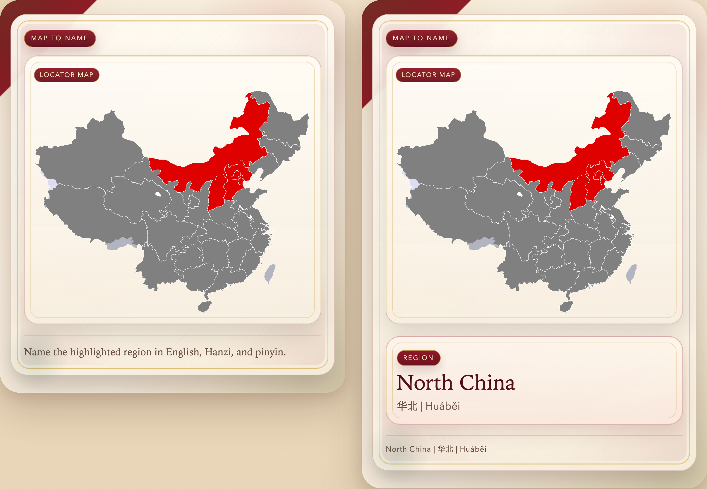

# Regions of China: Hanzi, Pinyin, English, and Maps

An Anki deck for learning the standard PRC statistical regions of China through Hanzi, pinyin, English names, member provinces, and crisp SVG map recall.

Published deck:

- [AnkiWeb shared deck](https://ankiweb.net/shared/info/159990073?cb=1774480687353)

## Card Preview

Front and back of the deck's main map-to-name card:



For an AnkiWeb-ready HTML snippet that hotlinks this GitHub-hosted screenshot, see [`docs/ankiweb-shared-description.html`](docs/ankiweb-shared-description.html).

The deck covers:

- North China
- East China
- South Central China
- Southwest China
- Northeast China
- Northwest China

## Sources

The deck is based on the region definitions and map files used on:

- [List of regions of China](https://en.wikipedia.org/wiki/List_of_regions_of_China)

The article's maps resolve to Wikimedia Commons SVG files, not just raster previews. The six region-specific SVGs are available as original vector files at nominal size `857 x 699`, and there is also a combined overview SVG.

The shared blank-map base requested for every note is:

- [File:China blank map.svg](https://commons.wikimedia.org/wiki/File:China_blank_map.svg)

## Build Workflow

Install the deck-building dependencies:

```sh
uv sync --extra deck
```

Fetch the blank map and region locator SVGs:

```sh
uv run python scripts/fetch_region_media.py
```

Build the Anki package:

```sh
uv run python scripts/build_apkg.py
```

Output:

- `out/chinese-regions.apkg`

The builder expects the required SVG files to be present locally and will stop with a clear error if the fetch step has not been run.

## Card Set

Current live cards:

1. Hanzi -> Pinyin
2. Hanzi -> English
3. English -> Chinese
4. Region -> list of member provinces
5. Members + blank map -> locator map
6. Region -> connections
7. Region + blank map -> locator map
8. Locator map -> region name

The visual direction is intentionally atlas-like rather than generic Anki:

- warm paper gradients instead of flat white
- jade / vermillion / gold accents
- editorial serif typography for names
- framed map panels for the image cards

## Repo Layout

- `data/raw/` contains the reviewed seed rows and media-source manifest
- `scripts/fetch_region_media.py` downloads the required SVG files from Wikimedia Commons
- `scripts/build_apkg.py` builds the final `.apkg`
- `scripts/render_card_previews.py` renders local HTML showcase pages for screenshot capture
- `media/regions/` is a generated local cache for deck media and is not committed
